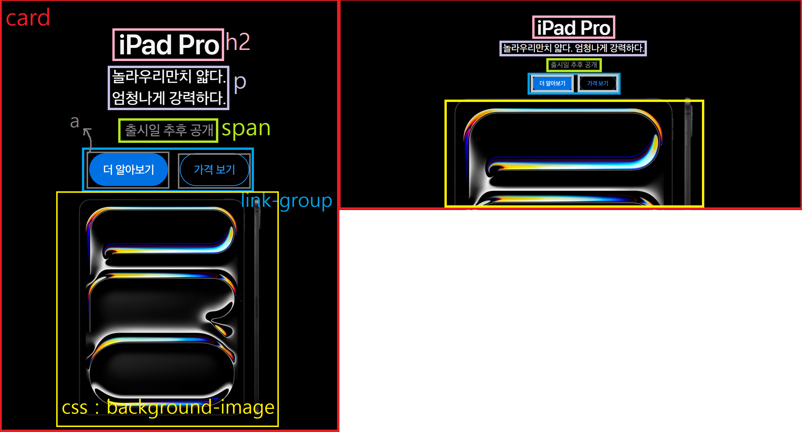
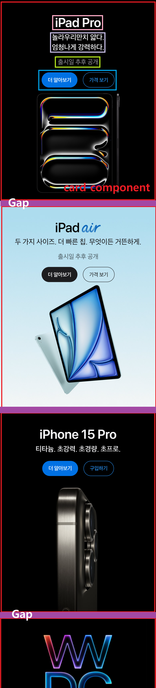
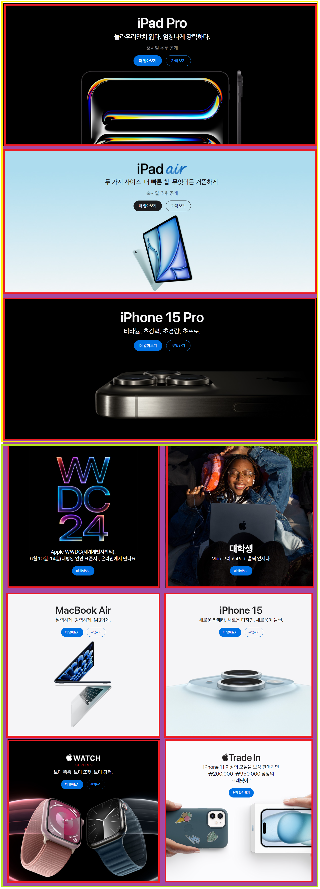
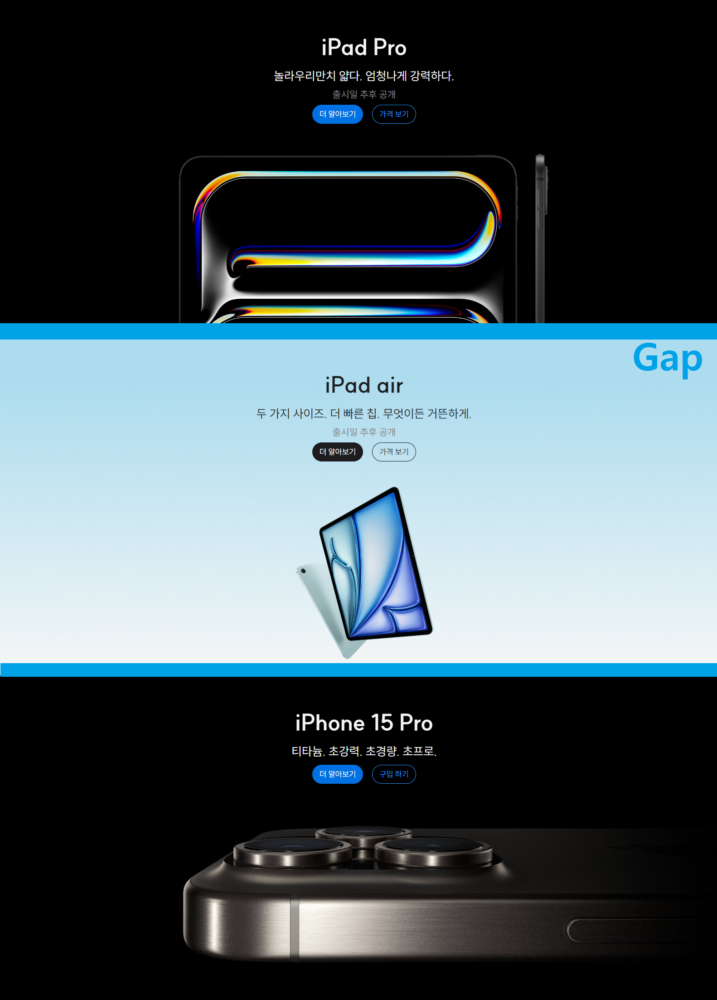
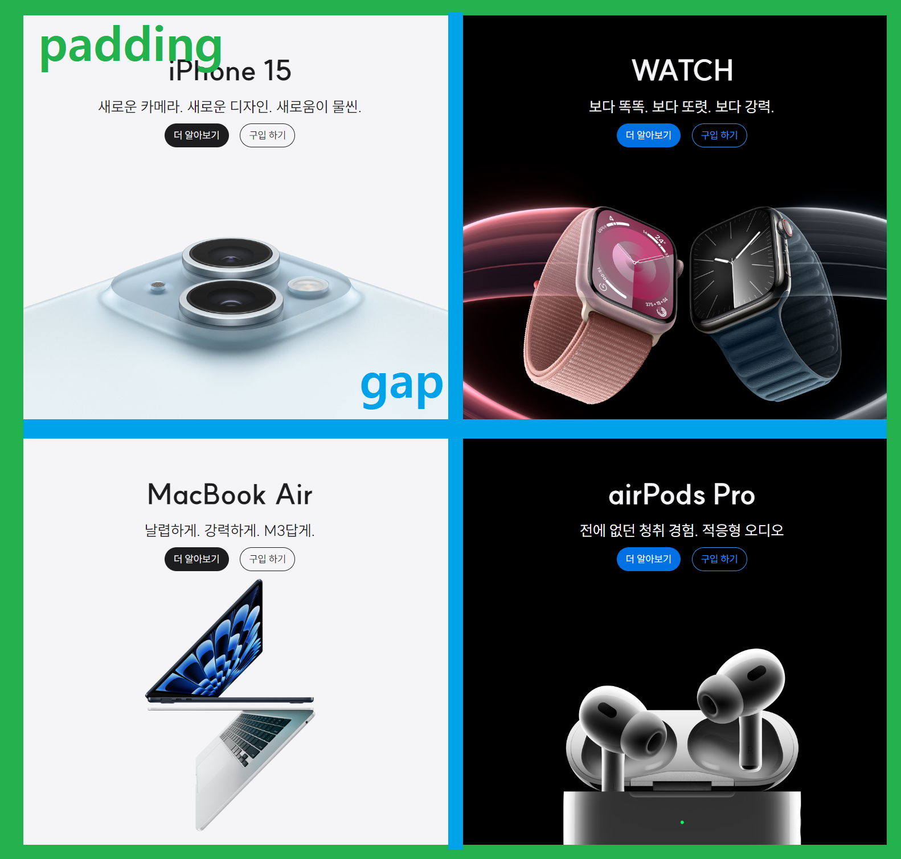

# 과제3_Apple 제품 카드 및 레이아웃
# ⚠️ 과제 시작 전 생각
1. mobile first
2. 카드 컴포넌트 먼저 만들기
3. grid를 사용하여 레이아웃 배치하기
# 1. Apple 제품 카드 컴포넌트


1. card : 제품내용을 감싸며 클래스이름을 card라고 붙여줌.
2. h2 : card 컴포넌트의 제목(heading)
3. p : card 컴포넌트의 제목을 설명해주는 부제목, 설명해주는 내용이라 p태그를 사용함.<br />
모바일에서는 2줄, 데스크탑에서는 1줄로 나오기 때문에 2개로 만들어서 하나에는 클래스를 부여하여 줄수를 조절하였다.
4. span : 컴포넌트에 있기도하고 없기도한 내용이라 중요하지 않아보여 span으로 주었다. 
5. link-group : a 태그를 묶어서 클래스이름을 link-group이라고 지음 (button이였으면 button-group이라고 지었다🤔)
6. a : button인줄 알았지만 Apple 홈페이지 들어가서 클릭해보니 다른 곳으로 이동하는 a태그였다.<br />
페이지를 이동할 경우 a, 스크립트 및 동작을 할 경우에는 button을 사용해야 된다.
7. background-image : 반응형 이미지를 주기 위해 img태그보다 card component에 background-image를 사용함. <br />
각각의 배경화면을 주기 위해 각 card component에 클래스 이름을 부여한 후 따로 빼내어서 background-image를 관리함.
8. (1) ipad-pro, iphone15-pro, .apple-watch, .airpods-pro<br />
(2) ipad-air, iphone15, macbook-air 의 공통요소(버튼이나 글씨색상)을 따로 분리하였다.

```html
<section class="card">
  <h2>iPad Pro</h2>
  <p>놀라우리만치 얇다.<br />엄청나게 강력하다.</p>
  <p class="is-desktop">놀라우리만치 얇다. 엄청나게 강력하다.</p>
  <span>출시일 추후 공개</span>
  <div class="link-group" role="group">
    <a href="#">더 알아보기</a>
    <a href="#">가격 보기</a>
  </div>
</section>
```
```css
/* card component */
.card {
  position: relative;
  z-index: 1;
  display: flex;
  flex-flow: column nowrap;
  justify-content: flex-start;
  align-items: center;
  width: 100%;
  inline-size: 100%;
  min-height: var(--size);
  height: 100%;
  block-size: 100%;
  padding-top: var(--large-spacing);
  background-repeat: no-repeat;
  background-size: cover;
  background-position: center 100%;

  h2 {
    font-size: var(--large-text);
    font-weight: 700;
    margin-bottom: var(--small-spacing);
  }

  p {
    font-size: var(--base-text);
    line-height: var(--line-normal);
    margin-bottom: var(--x-small-spacing);

    &.is-desktop {
      display: none;
    }
  }
  
  span {
    font-size: var(--small-text);
    color: var(--gray);
    margin-bottom: var(--x-small-spacing);
  }

  .link-group {
    position: relative;
    z-index: 100;
  }

  a {
    display: inline-flex;
    justify-content: center;
    align-items: center;
    font-size: var(--xx-small-text);
    color: var(--white);
    padding: var(--x-small-spacing) var(--small-spacing);
    margin-right: var(--small-spacing);
    white-space: nowrap;
    border: 1px solid transparent;
    border-radius: 50px;
    transition: all 300ms ease-in-out;

    &:last-child {
      background-color: transparent;
      margin-right: 0;
    }
  }

  @media (min-width: 1024px) {
    padding-top: var(--extra-large-spacing);
    height: 580px;

    h2 {
      font-size: var(--extra-large-text);
    }

    p {
      font-size: var(--medium-text);
    }

    &.ipad-pro, &.airpods-pro, &.iphone15 {
      p {
        display: none;
      }
      
      p.is-desktop {
        display: block;
      }
    }

    a {
      font-size: var(--x-small-text);
    }
  }
}

/* 7. background-image for each component */
.ipad-pro {
  background-image: image-set(url('../products/ipad_pro.jpeg') 1x, url('../products/ipad_pro_2x.jpeg') 2x);
  
  @media (min-width: 1024px) {
    background-image: image-set(url('../products/ipad_pro_wide.jpeg') 1x, url('../products/ipad_pro_wide_2x.jpeg') 2x);
  }
}
.ipad-air {
  background-image: image-set(url('../products/ipad_air.jpeg') 1x, url('../products/ipad_air_2x.jpeg') 2x);
  
  @media (min-width: 1024px) {
    background-image: image-set(url('../products/ipad_air_wide.jpeg') 1x, url('../products/ipad_air_wide_2x.jpeg') 2x);
  }
}
.iphone15-pro {
  background-image: image-set(url('../products/iphone15_pro.jpeg') 1x, url('../products/iphone15_pro_2x.jpeg') 2x);
  
  @media (min-width: 1024px) {
    background-image: image-set(url('../products/iphone15_pro_wide.jpeg') 1x, url('../products/iphone15_pro_wide_2x.jpeg') 2x);
  }
}
.iphone15 {
  background-image: image-set(url('../products/iphone15.jpeg') 1x, url('../products/iphone15_2x.jpeg') 2x);
}
.apple-watch {
  background-image: image-set(url('../products/apple_watch.jpeg') 1x, url('../products/apple_watch_2x.jpeg') 2x);
}
.macbook-air {
  background-image: image-set(url('../products/macbook_air.jpeg') 1x, url('../products/macbook_air_2x.jpeg') 2x);
}
.airpods-pro {
  background-image: image-set(url('../products/airpods_pro.jpeg') 1x, url('../products/airpods_pro_2x.jpeg') 2x);
}

/* common element for card component */
/* 8-(1) */
.ipad-pro, .iphone15-pro, .apple-watch, .airpods-pro {
  color: var(--white);

  a {
    background-color: var(--blue-300);

    &:last-child {
      color: var(--blue-100);
      border-color: var(--blue-100);
    }

    &:hover {
      background-color: var(--blue-200);
      color: var(--white);
    }
  }
}
/* 8-(2) */
.ipad-air, .iphone15, .macbook-air {
  color: var(--black);

  a {
    background-color: var(--black);

    &:last-child {
      color: var(--black);
      border-color: var(--black);
    }

    &:hover {
      background-color: #272729;
      color: var(--white);
    }
  }
}
```

---

# 2. Apple 제품 카드 레이아웃(배치)
## 1. 모바일의 경우 ( < 1024px )

### ❗ 컴포넌트가 반복되어 이미지가 너무 길어서 아래를 잘랐습니다! 
1. card component : 위에서부터 순차적으로 쌓인다.
2. gap : card component 사이의 여백(gap)

## 2. 데스크탑의 경우 ( > 1024px )


1. 위의 3개의 컴포넌트는 1줄에 1개를 차지한다 (노란색 상자) 
2. 3개 이후의 컴포넌트들은 1줄에 2개씩 차지한다 (연두색 상자)
3. 위(top), 아래(bottom) 따로 컴포넌트들을 감싼 후 각각 grid를 따로 선언했다.

```html
<div class="container">
  <div class="top">
    <section class="card ipad-pro">
      <h2>iPad Pro</h2>
      <p>놀라우리만치 얇다.<br />엄청나게 강력하다.</p>
      <p class="is-desktop">놀라우리만치 얇다. 엄청나게 강력하다.</p>
      <span>출시일 추후 공개</span>
      <div class="link-group" role="group">
        <a href="#">더 알아보기</a>
        <a href="#">가격 보기</a>
      </div>
    </section>
    <section class="card ipad-air">
      <h2>iPad air</h2>
      <p>두 가지 사이즈. 더 빠른 칩.<br />무엇이든 거뜬하게.</p>
      <p class="is-desktop">두 가지 사이즈. 더 빠른 칩. 무엇이든 거뜬하게.</p>
      <span>출시일 추후 공개</span>
      <div class="link-group" role="group">
        <a href="#">더 알아보기</a>
        <a href="#">가격 보기</a>
      </div>
    </section>
    <section class="card iphone15-pro">
      <h2>iPhone 15 Pro</h2>
      <p>티타늄. 초강력. 초경량. 초프로.</p>
      <div class="link-group" role="group">
        <a href="#">더 알아보기</a>
        <a href="#">구입 하기</a>
      </div>
    </section>
  </div>
  <div class="bottom">
    <section class="card iphone15">
      <h2>iPhone 15</h2>
      <p>새로운 카메라.<br />새로운 디자인.<br />새로움이 물씬.</p>
      <p class="is-desktop">새로운 카메라. 새로운 디자인. 새로움이 물씬.</p>
      <div class="link-group" role="group">
        <a href="#">더 알아보기</a>
        <a href="#">구입 하기</a>
      </div>
    </section>
    <section class="card apple-watch">
      <h2>WATCH</h2>
      <p>보다 똑똑. 보다 또렷. 보다 강력.</p>
      <div class="link-group" role="group">
        <a href="#">더 알아보기</a>
        <a href="#">구입 하기</a>
      </div>
    </section>
    <section class="card macbook-air">
      <h2>MacBook Air</h2>
      <p>날렵하게. 강력하게. M3답게.</p>
      <div class="link-group" role="group">
        <a href="#">더 알아보기</a>
        <a href="#">구입 하기</a>
      </div>
    </section>
    <section class="card airpods-pro">
      <h2>airPods Pro</h2>
      <p>전에 없던 청취 경험.<br />적응형 오디오.</p>
      <p class="is-desktop">전에 없던 청취 경험. 적응형 오디오</p>
      <div class="link-group" role="group">
        <a href="#">더 알아보기</a>
        <a href="#">구입 하기</a>
      </div>
    </section>
  </div>
</div>
```

```css
/* card layout */
.container, .top, .bottom {
  display: grid;
  grid-template-columns: 1fr;
  gap: var(--base-spacing);
}

.container {
  @media (min-width: 1024px) {
    gap: 0;
  }
}

.bottom {
  @media (min-width: 1024px) {
    grid-template-columns: 1fr 1fr;
    padding: var(--base-spacing);
  }
}
```
1. container로 top, bottom을 전체적으로 묶었다.
2. container, top, bottom의 공통적인 부분(mobile일 때)을 공통요소로 빼냈다.
3. 변화되는 것은 1024px 이후 container와 bottom인데, container는 bottom에 padding을 주었기 때문에 32px이 되어 1024이후 0을 주었다. <br />
bottom은 1024px이후의 데스크탑에서 2개로 분리되면서 padding값을 주어 레이아웃을 배치했다.

✏️ 결과
1. top부분

2. bottom 부분


---

* grid보다는 flexbox를 사용하는 것을 매우 좋아했지만 이번 예제를 통해서 확실히 복잡한 구조가 아니면 grid가 더 편한 것은 느낌이 들었다.😎
* 과거에는 레이아웃과 컴포넌트를 하나로 작성했는데 이번에 CSS를 작성할 땐 레이아웃부분에는 순수하게 레이아웃부분만, 컴포넌트부분에는 컴포넌트 관련만 작성하여 분리했다.<br />
보기에도 더 좋아보이고, 후에 수정할 내용이 있다면 레이아웃이면 레이아웃부분만, 컴포넌트면 컴포넌트부분만 찾아서 보면되니까 편할 것 같다.