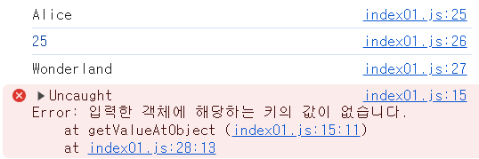
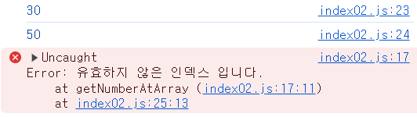
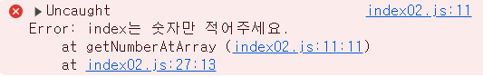

# [JavaScript] mission01

## 문제1
* 객체에서 특정 키의 값을 안전하게 가져오는 함수를 작성하세요.
* 객체와 키를 인수로 받아 - (1)
* 객체에 해당 키가 존재하면 그 키에 해당하는 값을 반환 - (2)
* 존재하지 않으면 에러를 발생 - (3)

**1. 내가 짠 코드**
```javascript
function getValueAtObject(obj, key) { // (1)
  let receivedObj = Object.keys(obj);
    
  if(receivedObj.includes(key)) { // (2)
    return obj[key];
  } else { // (3)
    throw new Error('입력한 객체에 해당하는 키의 값이 없습니다.');
  }
}

const person = {
  name: 'Alice',
  age: 25,
  city: 'Wonderland'
};

console.log(getValueAtObject(person, 'name')); // 'Alice'
console.log(getValueAtObject(person, 'age')); // 25
console.log(getValueAtObject(person, 'city')); // 'Wonderland'
console.log(getValueAtObject(person, 'country')); // Error !
```
**2. 실행 결과**



---

## 문제2
* 배열에서 특정 인덱스의 값을 안전하게 가져오는 함수를 작성하세요.
* 배열과 인덱스를 인수로 받아 - (1)
* 인덱스가 배열의 유효한 범위 내에 있으면 그 인덱스에 해당하는 값을 반환하고 - (2)
* 유효하지 않은 인덱스일 경우 에러 메시지를 반환 - (3)

**1. 내가 짠 코드**
```javascript
function getNumberAtArray(arr, index) { // (1)
  if(typeof index === 'string') {
    throw new Error('index는 숫자만 적어주세요.');
  }

  if(arr.includes(arr[index])) { // (2)
    return arr[index];
  } else {
    throw new Error('유효하지 않은 인덱스 입니다.'); // (3)
  }
}

const numbers = [10, 20, 30, 40, 50];

console.log(getNumberAtArray(numbers, 2)); // 30
console.log(getNumberAtArray(numbers, 4)); // 50
console.log(getNumberAtArray(numbers, 5)); // Error!
console.log(getNumberAtArray(numbers, -1)); // Error!
console.log(getNumberAtArray(numbers, '3')); // string일 때 오류나도록
```
**2. 실행 결과**


