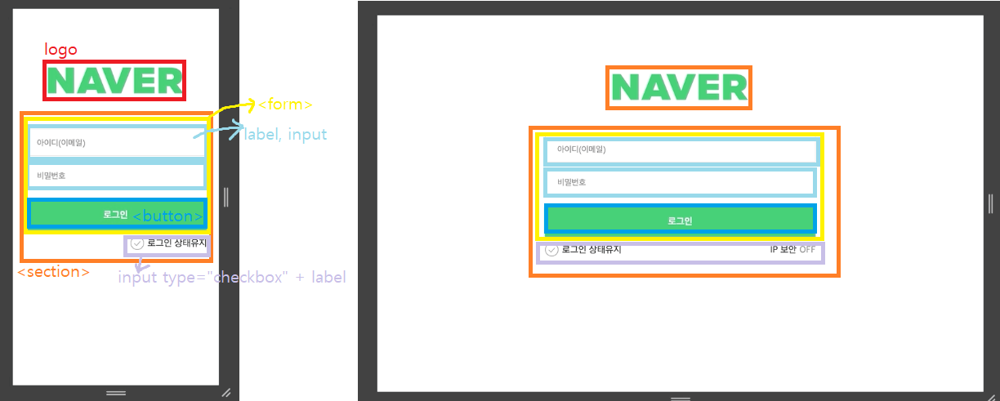
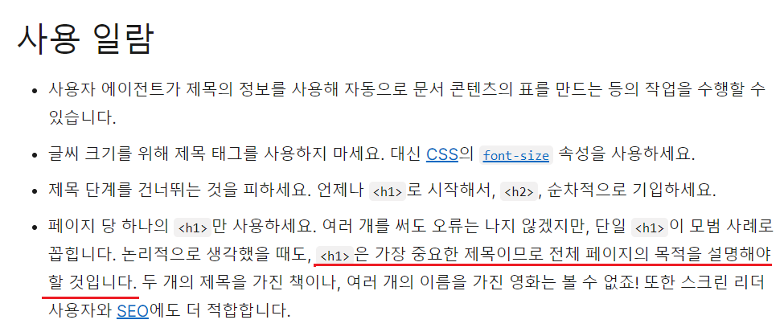
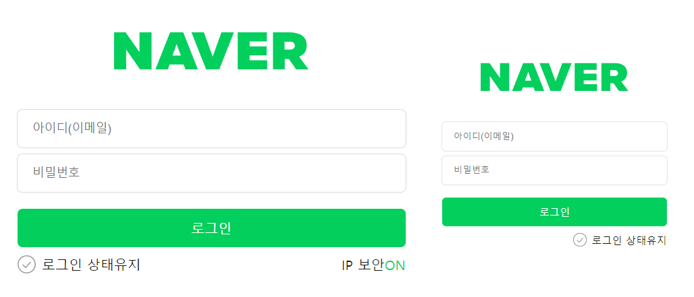

# 과제2_네이버페이지 만들기
* 레이아웃 구조


---

* reset CSS 구조
```css
/* reset */
*, *::before, *::after {
  margin: 0;
  padding: 0;
  box-sizing: border-box;
  font-size: 1rem;

  &:focus, &:focus-visible {
    outline: 2px solid var(--focus-color);
  }
}

html, body {
  font-size: 1rem;
  color: var(--base-color);
}

body {
  display: flex;
  flex-flow: column nowrap;
  justify-content: center;
  align-items: center;
  width: 100vw;
  inline-size: 100vw;
  height: 100vh;
  block-size: 100vh;
}

a {
  color: inherit;
  text-decoration: none;
}

ul {
  list-style: none;
  padding-left: 0;
}

input {
  margin: 0;
  border: none;
  appearance: none;
}

.sr-only {
  position: absolute;
  top: -9999px;
  left: -9999px;
  width: 1px;
  inline-size: 1px;
  height: 1px;
  block-size: 1px;
  margin: -1px;
  clip: rect(0, 0, 0, 0);
  clip-path: polygon(0 0, 0 0, 0 0);
  overflow: hidden;
  padding: 0;
  white-space: nowrap;
  border-width: 0;
}
```
---

* 변수 사용 : 전역변수는 :root로, 컴포넌트안에서만 쓰이는 것들은 지역변수로 사용했다.
```css
:root {
  --base-color: #181818;
  --base-fontSize: 16px;
  --focus-color: #24388d;
  --primary-color: #03cf5d;
}

.form-input {
  --outline-color: #dadada;
  --input-bg-color: #fff;
  --input-focus-bg-color: #e9f0fd;
}

.login-button {
  --button-accent-color: #09aa5c;
}
```

---

## ❓ 만들다 생긴 고민 및 해결방법 ❓
1. HTML : 로고 이미지는 배경이 아닌 &lt;img&gt; 요소로 마크업 <br />
→ 로고를 만들 때 heading element를 써야될까...
 출처 : [MDN](https://developer.mozilla.org/ko/docs/Web/HTML/Element/Heading_Elements)
2. CSS : 포커스 스타일 커스텀 (색상 #24388d) <br />
→ focus에 대해 TIL로 정리했던 내용을 다시 확인했다. <br />
→ input에도 focus가 있어서 일단 전체선택자로 모든 요소에 focus를 넣은 후, 나중에 input에 focus를 지정하여 input요소에 focus하면 다른 색상이 들어가도록 함.
```css
*, *::before, *::after {
  ...

  &:focus, &:focus-visible {
    outline: 2px solid var(--focus-color);
  }
}

input {
  ...

  &:focus {
      outline-color: var(--primary-color);
  }
}
```
3. CSS : 테두리 선을 할 때 outline으로 할까? border로 할까? <br />
→ border를 사용하면 공간을 차지하고 그에 비해 outline은 공간을 차지하지 않아 outline을 사용했다.
4. HTML+CSS : 로그인 상태유지와 IP 보안 ON/OFF는 스위치는 키보드로도 조작 가능하도록 구현  <br />
❓ 방법1 : input checkbox를 만든 후 checked일때는 ON을 보여주고 아닐 땐 가상요소선택자를 사용하여 OFF를 쓰면 되지 않을까? <br />
→ 스크린 리더가 읽지 않아서 사용자가 OFF 상태를 모른다.
```html
<div class="ip-toggle-group">
  <input type="checkbox" id="toggle-on" name="on" checked />
  <label for="toggle-on" class="is-on">ON</label>
</div>
```
```css
input[id="toggle-on"]:checked + .is-on {
  display: block;
}

input:not(:checked) + label::before {
  content: 'OFF';
  display: inline-block;
  width: 100%;
  height: 100%;
  cursor: pointer;
  color: var(--toggle-off-color);
}
```
❓ 방법2 : on, off상태의 input을 만든 후 on이 checked일 때 보여주면서 off가 안보이고, on이 check상태가 아닐 때 off가 보이도록 하고 싶었지만... <br />
→ ON상태 일때는 괜찮은데 ON, OFF가 같이 보인다.
```html
<div class="ip-toggle-group">
  <input type="checkbox" id="toggle-on" name="on" checked />
  <label for="toggle-on" class="is-on">ON</label>
  <input type="checkbox" id="toggle-off" name="off" />
  <label for="toggle-off" class="is-off">OFF</label>
</div>
```
```css
input[id="toggle-on"]:checked + .is-on {
  display: block;
}
input[id="toggle-on"]:not(:checked) + .is-on {
  display: none;
}
input[id="toggle-off"]:checked ~ .is-off {
  display: block;
}
input[id="toggle-off"]:not(:checked) ~ .is-off {
  display: none;
}
```
❓ 방법3 : 방법2와 같은 생각이면서 CSS를 고쳐보았다. <br />
→ 키보드와 마우스 잘 작동이 되지만 개발자 모드로키면 input[id="toggle-on"]만 focus되는 오류가...😟
```css
input[id="toggle-on"]:checked ~ .is-on,
input[id="toggle-on"] {
  display: block;
}
input[id="toggle-on"]:not(:checked) ~ .is-on,
input[id="toggle-off"] {
  display: none;
}
input[id="toggle-on"]:not(:checked) ~ .is-off,
input[id="toggle-off"] {
  display: block;
}
input[id="toggle-off"]:checked ~ .is-off,
input[id="toggle-off"] {
  display: none;
}
```

---

## <결과물>

* WAI-ARIA가 아닌 HTML 네이티브 방식으로 구현해야해서 마크업에 대해 많이 생각하였지만 부족한거같다...
* 기능은 구현 다 했지만 CSS만으로 구현하려니 자바스크립트 생각이 많이났다..😥
* CSS에 변수를 써서 관리하는거는 많이 안해봤는데 확실히 나중에 유지보수할 때 좋을꺼 같다.


